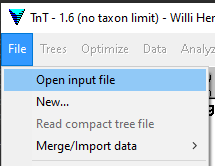

# TNT analysis

Analyse a dataset using Fitch parsimony under equal and implied weights in TNT.

## Set up

- Copy the input file in TNT or NEXUS format into the `TNT` directory

- Open `tnt.run` with your favourite
  [text editor](https://notepad-plus-plus.org/downloads/)

- Enter the name of the input file in the line
  `proc ENTER_INPUT_FILENAME_HERE;`.
  For example this might end up reading `proc my_data.nex;`.

- Enter the name of the outgroup taxon in the line
  `outgroup ENTER_OUTGROUP_LABEL_HERE;`.
  For example this might end up reading `outgroup Homo_sapiens;`.

## Run analysis

You will need to download [TNT](https://www.lillo.org.ar/phylogeny/tnt/)
and extract the folder `TNT-bin` to a memorable location on your computer,
for example (Windows) `c:/programs/phylogeny/TNT-bin`

### Interactively

To run the script in the TNT GUI:

- Launch TNT by double-clicking `wTNT.exe` (Windows) or `gTNT` (Linux, Mac),
  found in the `TNT-bin` folder.

- Use "File → Open input file" to open `tnt.run`. 
  You may need to select `ALL files` in stead of `TNT files` from the bottom dropdown box.

- The analysis should begin immediately.

### From the command line

To run the script from the command line:

- Add the `TNT-bin` folder to your `PATH` system environment variable.
  - OR: copy the `tnt` executable from the `TNT-bin` directory to the `TNT`
  folder that contains this `README.md` file and `tnt.run`.

- Launch the command line / terminal
  - In Windows, open the Start Menu and type "CMD" for "Command prompt"

- Navigate to the folder containing the script file.
  - `cd ..` goes up a directory; `cd mydir` moves to the subdirectory `mydir`

- type `tnt tnt.run;` to begin the analysis.
