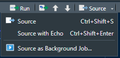

# TreeSearch analysis

Conduct phylogenetic analysis using the approximate correction for inapplicable
tokens proposed by Brazeau, Guillerme & Smith
([2019](https://doi.org/10.1093/sysbio/syy083))

## Installing TreeSearch

- Download and install [R](https://cran.r-project.org/bin/windows/base/)

- Open R and type `install.packages("TreeSearch")` to download TreeSearch.

## Inputting data

- Copy the Nexus file containing character data into the `TreeSearch` folder
  - Ensure that the file has the ending `.nex`
  - If multiple `.nex` files are present, the file with the alphabetically
    latest name will be used.
    Because MorphoBank matrix downloads include a timestamp in their filename,
    this means that the latest such matrix will be used, as long as no other
    Nexus files are present.

## Interactive Usage

- Open the `TreeSearch.Rproj` project in [RStudio](https://posit.co/)

- Open `analyse.R` and, optionally, set the values of `searchRepeats` and
  `kValues`

- In RStudio, select "Source → Source as Background job" and `Start` the script.

## Command-line usage

Alternatively, for potentially better performance, run the search at the
command line.

- Open `analyse.R` in your favourite
 [text editor](https://notepad-plus-plus.org/downloads/) and check -- and if
  desired modify -- the values of `searchRepeats` and `kValues`

- Launch a command line terminal in the TreeSearch folder
  - Windows: Open the start menu and type "cmd" for "Command prompt", then type
    `cd ../` to navigate up the file directory, and `cd path` to enter a
    directory

- Run the script in R by typing `Rscript analyse.R`
