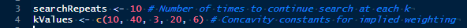

# TreeSearch analysis

Conduct phylogenetic analysis using the approximate correction for inapplicable
tokens proposed by Brazeau, Guillerme & Smith
([2019](https://doi.org/10.1093/sysbio/syy083))

## Install TreeSearch

- Download and install [R](https://cran.r-project.org/bin/windows/base/)

- Open R and type `install.packages("TreeSearch")` to download TreeSearch.

## Input data

- Copy the Nexus file containing character data into the `TreeSearch` folder
  - Ensure that the file has the ending `.nex`
  - If multiple `.nex` files are present, the file with the alphabetically
    latest name will be used.
    Because MorphoBank matrix downloads include a timestamp in their filename,
    this means that the latest such matrix will be used, as long as no other
    Nexus files are present.

## Run the analyses

### Point and click usage

- Double-click `analyze.lnk` to launch the analysis (Windows)

- Once tree search is complete, double-click `visualize.lnk` to plot
  results to PDF.

### Interactive Usage

- Open the `TreeSearch.Rproj` project in [RStudio](https://posit.co/)

- Open `analyse.R` and, optionally, set the values of `searchRepeats`,
  `kValues`, and `timeout`

- In RStudio, select "Source → Source as Background job" and `Start` the script.

- Open `visualize.R` and set the value of `outgroup`

- Once tree search is complete, source `visualize.R`.

### Command-line usage

Alternatively, for potentially better performance, run the search at the
command line.

- Open `analyse.R` in your favourite
 [text editor](https://notepad-plus-plus.org/downloads/) and check – if
  desired, modify – the values of `searchRepeats`, `kValues` and `timeout`

- Launch a command line terminal in the TreeSearch folder
  - Windows: Open the start menu and type "cmd" for "Command prompt", then type
    `cd ../` to navigate up the file directory, and `cd path` to enter a
    directory

- Run the script in R by typing `Rscript analyse.R`

- Once complete, visualize results by typing `Rscript visualize.R`

## What will happen

- TreeSearch will search for optimal trees under equal weights, then under
  equal weights using the concavity constants (`kValues`) in the order specified.

- Once each tree search is complete or times out, results will be written to
  a file named `<weighting>_<input_file_name>.trees`.

- For each `searchRepeats`, tree search will resume from the relevant `.trees`
  file.  Keep an eye on the output; once you are satisfied that tree score
  has reached an optimal value, you might consider tree search complete.

- `visualize.R` will take the latest output from the `.trees` file to plot
  a summary tree and a mapping of search progress in tree space to a like-named
  `.pdf` file.
  See [vignette](https://ms609.github.io/TreeSearch/articles/tree-search.html)
  for suggestions for interpreting the completeness of tree search.
